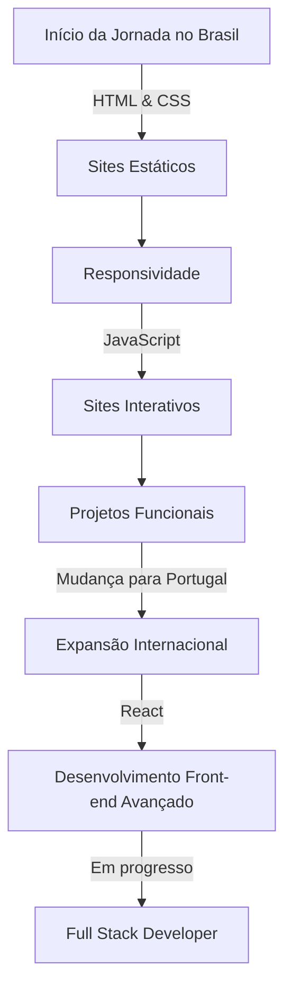

<div align="center">
  
</div>

## 🧙‍♂️ Quem Sou Eu

```javascript
const manoelGosalan = {
  localização: "Porto, Portugal 🇵🇹 (Brasileiro 🇧🇷)",
  stack: ["HTML", "CSS", "JavaScript", "React", "Python", "Git", "Node.js"],
  visão: "Transformar ideias em código que resolve problemas reais",
  jornada: "De Brasil para Portugal, evoluindo a cada commit",
  mantra: "Código limpo hoje = menos bugs amanhã",
  hobbs: "Games, Tecnologia, Animes"
};
                    // Em andamento 🚀
const Estudos = [
  { tech: "Node.js", status: "explorando rotas, APIs REST" },
  { tech: "TypeScript", status: "refatorando JS e criando tipagens" },
  { tech: "React Native", status: "apps em progresso" },
  { tech: "TailwindCSS", status: "testando estilização com utilitários" },
  { tech: "MongoDB", status: "estrutura de dados flexível no back" }
];

```

## 🛠️ Tech Stack & Skills

<div align="center" style="display: inline_block">
  
  
  
  
  
  
  
</div>

## 🌱 Tecnologias em Evolução

<div align="center" style="display: inline_block">
  
  
  
  
  
</div>

### 📈 Progresso de Aprendizado (Estilo RPG ⚔️)

```plaintext
🧙 Node.js......... [███████▒▒▒▒] 60%
🧙 TypeScript...... [███▒▒▒▒▒▒▒▒] 30%
🧙 React Native.... [██▒▒▒▒▒▒▒▒▒] 25%
🧙 TailwindCSS..... [███▒▒▒▒▒▒▒▒] 30%
🧙 MongoDB......... [█▒▒▒▒▒▒▒▒▒▒] 15%
```

### 📱 Projetos Responsivos & Interativos

<div align="center">
  <a href="https://mgosalan-dev.github.io/horas-do-dia" title="Ver Site horas-do-dia">
    
  </a>
  <a href="https://mgosalan-dev.github.io/Contador-de-Horas" title="Ver Site Contador-de-Horas">
    
  </a>
</div>

**⭐ Horas do Dia**: Site dinâmico que atualiza o fundo e as imagens conforme o período (manhã, tarde, noite), mostrando a hora atual ao utilizador com interface responsiva e intuitiva.

**⭐ Contador de Horas**: Aplicação web completa que permite controlar horas, com capacidade de exportar para PDF. Inclui estilização CSS avançada e lógica JavaScript para manipulação de tempo.

### 🎨 Projetos Front-end Estilizados

<div align="center">
  <a href="https://mgosalan-dev.github.io/World-Of-Warcraft" title="Ver site World-Of-Wacraft">
    
  </a>
  <a href="https://mgosalan-dev.github.io/Cordel/" title="Ver site Cordel">
  
</a>
</div>

**⭐ World of Warcraft**: Site responsivo inspirado no universo WoW, com design adaptativo para diferentes dispositivos e técnicas avançadas de CSS para criar uma experiência imersiva.

**⭐ Projeto Cordel**: Implementação web de cordel com efeito parallax, combinando HTML5 semântico e CSS3 moderno para criar uma experiência de leitura interativa e responsiva.

### 🧠 Projetos Funcionais

<div align="center">
  <a href="https://github.com/mgosalan-dev/Idade-de-Voto-e-Alistamento">
    
  </a>
  <a href="https://github.com/mgosalan-dev/verificacao-de-voto">
    
  </a>
</div>

**⭐ Idade de Voto**: Aplicação que verifica elegibilidade de voto com base na idade, combinando HTML, CSS e JavaScript para criar uma ferramenta prática e estilizada.

**⭐ Verificação de Voto**: Sistema que analisa a situação eleitoral do utilizador, utilizando lógica JavaScript para processar dados e retornar resultados personalizados.

## 📊 Minhas Estatísticas

<div align="center">
  
  
</div>

<div align="center">
  
</div>

## 🌍 Minha Jornada



## 📱 Me Encontre

<div align="center">
  <a href="https://instagram.com/manoel_lidio_gosalan" target="_blank">
    
  </a>
  <a href="https://www.linkedin.com/in/manoel-lidio-gosalan-dos-santos-6954a7263/" target="_blank">
    
  </a>
  <a href="mailto:mgosalan.dev@gmail.com" target="_blank">
    
  </a>
</div>

## 📌 Sobre Portugal

<details>
  <summary>Clicar para expandir</summary>
  
  Atualmente baseado em Porto, Portugal 🇵🇹, estou a expandir meus horizontes profissionais enquanto trago comigo todo o conhecimento e criatividade brasileira. Busco oportunidades para aplicar minhas habilidades no mercado europeu, mantendo as raízes e o estilo de desenvolvimento que aprendi no Brasil.
  
  **Por que Portugal?**
  - Mercado tech em expansão
  - Comunidade de desenvolvedores internacional
  - Qualidade de vida para profissionais de tecnologia
  - Ponte entre culturas brasileira e europeia

</details>

## 🔥 Contador de Visitantes

<div align="center">
  
</div>

<div align="center">
  
  
</div>


